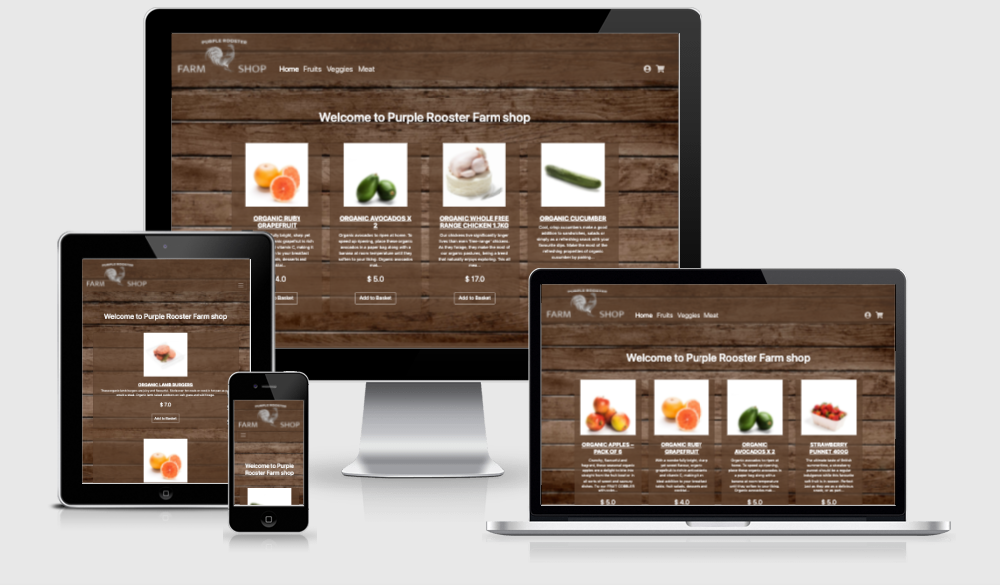

# Purple Rooster Farm Shop

The local farm shop site that promotes their products online with the ability to reserve goods in advance.

Live site location:

[Purple Rooster Farm Shop Website](https://purple-rooster.herokuapp.com/)

Live site screenshot:

#### Table of Contents

[UX](#ux)

[Features](#features)

- [Existing Features](#existing-features)
  - [Site content](#site-content)
  - [Style Information](#style-information)
- [Features Left to Implement](#features-left-to-implement)

[Technologies Used](#technologies-used)

[Testing](#testing)

- [Known issues](#known-issues)

- [Deployment](#deployment)
- [Development](#development)

- [Credits](#credits)

## UX

The typical website user is interested in sourcing local farm products.

The site owners goal is to promote products that is for sale in the local farm shop and administrator reservations from website users.

- As an admin user, I would like to [CRUD](https://en.wikipedia.org/wiki/Create,_read,_update_and_delete) my products to the website so my customers can see what the farm shop currently sells.
- As a user, I would like to click and collect items for later pickup in the farm shop, so I know items is available when I visit the shop on site.
- As an admin, I would like to [CRUD](https://en.wikipedia.org/wiki/Create,_read,_update_and_delete) all click and collect so I can see all reservations and remove reservations.
- As a user, I would like to login to the site and see my click and collect, so I can follow up on what I have for pickups.
- As a admin, I would like to login to the site, so I can administrate products, click and collects & users.
- As an admin, I would like to comment on the click and collects, so I can let other admins know if the is anything to mention.

Site screenshots are found in the project folder [/wireframes](wireframes).

Site wireframes:

- [Front page](wireframes/front.png) search meal page, showing search results. Also acts as site index page
- [Product detail page](wireframes/product.png) display product details.
- [basket page](wireframes/reservation.png) display selected items for prepared for reservation.
- [user page](wireframes/user.png) display user details including click and collects.
- [Sign in Page](wireframes/signin.png) ability to sign in to the site.
- [Admin click and collects page](wireframes/list-reservations.png) list all users reservations for admin purposes
- [Admin list users page](wireframes/list-users.png) list all users for admin purposes

## Features

The website contains a clear navigation on every page.
The site is based on a navigational hierarchical tree structure.
Navigation bar is responsive and will fold down to a burger menu when it wont fit the size.

**Navigation items:**
Home
Category navigation
Click and collect basket
Sign in _(only anonymous users)_
My page _(only signed in users)_
Admin _(only signed in admins)_

Each page includes a footer element containing copyright information about the site.
[Footer wireframe example](wireframes/footer.png)

### Existing Features

- Sign in/out - allows user to sign in to see reservations made and sign out when user would like to leave.
- Sign up - allows user to sign up for an account so user don't have to fill out the information again.
- Find products by category - allows user to find products based on category.
- Add to click and collect basket - allows user to add product to a basket while navigating on the site.
- Create click and collect reservation - send current click and collect basket to the farm shop.
- Set requested pickup date
- Administrate users - CRUD
- Administrate products - CRUD
- Administrate categories - CRUD
- Administrate reservations - CRUD
- Upload product images to external CDN for use on website.

#### Database model

[MongoDB](https://www.mongodb.com/) is used to store all data. Whtin one cluster ("Cluster0") the database "roosterDB" contain the following collections:

- [Users collection](#users-collection)
- [Categories collection](#categories-collection)
- [Products collection](#products-collection)
- [Reservations collection](#reservations-collection)
  - [Products Array of objects](#products-array-of-objects)

##### Users collection

Users collection holds client contact and access information.

| field    | type     | description                |
| -------- | -------- | -------------------------- |
| \_id     | ObjectId | unique record id           |
| name     | string   | Holds client Full name     |
| email    | string   | Holds client email address |
| password | string   | user hashed password       |
| isAdmin  | Boolean  | Gives user admin access    |

##### Categories collection

Categories collection holds a list of the different product categories.

| field | type     | description         |
| ----- | -------- | ------------------- |
| \_id  | ObjectId | unique record id    |
| name  | string   | Holds Category name |

##### Products collection

Products collection holds information about each product.

| field       | type       | description                |
| ----------- | ---------- | -------------------------- |
| \_id        | ObjectId   | unique record id           |
| name        | string     | Holds product name         |
| description | string     | Holds product description  |
| price       | Decimal128 | product item price         |
| image-url   | string     | Holds url to product image |
| categories  | Array      | Array of categories id's   |

##### Reservations collection

Reservation collection holds each reservation in separate records.

| field                                  | type     | description                         |
| -------------------------------------- | -------- | ----------------------------------- |
| \_id                                   | ObjectId | unique record id                    |
| client_id                              | ObjectId | Client id                           |
| client-name                            | string   | Holds client Full name              |
| client-email                           | string   | Holds client email address          |
| [products](#products-array-of-objects) | Array    | Holds an array of product objects   |
| order-comment                          | string   | Client order comment                |
| order-date-pickup                      | Date     | Date when client pickups order      |
| order_placed                           | Boolean  | True when customer placed the order |

###### Products Array of objects

Each product client would like to reserve.

| field  | type       | description                                  |
| ------ | ---------- | -------------------------------------------- |
| id     | string     | products id reference                        |
| name   | string     | Holds product name                           |
| amount | Int32      | Number of items client would like to reserve |
| price  | Decimal128 | product item price                           |
| sum    | Decimal128 | the product of the amount and prices         |

#### Site content

The sample products, information and images is provided from Product [daylesford.com](https://www.daylesford.com/online-shop/)

About text is used from [Tapnell farm](https://tapnellfarm.com/about-tapnell-farm)

#### Style Information

##### Selected Typefaces

Site use sans-serif to stay clean on all supported platforms.

##### Color Scheme

The site color scheme is wooden and high contrast, with user information text and navigation bar in light color

### Features Left to Implement

- ...

## Technologies Used

In this section, all of the languages, frameworks, libraries, and any other tools that are used to construct this project are listed with its name, a link to its official site and a short sentence of why it was used.

- [HTML5](https://www.w3.org/TR/html52/)
  - Used to render the DOM
- [CSS](https://www.w3.org/Style/CSS/Overview.en.html)
  - Used to layout the site.
- [Javascript](https://developer.mozilla.org/en/JavaScript)
  - Used to handle site code logic and API integrations
- [Python+Flask](https://flask.palletsprojects.com/en/2.0.x/)
  - used to render site and connect to database
- [MongoDB](https://www.mongodb.com/)
  - Used to store all data.
- [Bootstrap](https://getbootstrap.com/docs/5.0/getting-started/introduction/)
  - used to make site responsive
- [Fontawesome](https://fontawesome.com/)
  - Used to display icons on website
- [JQuery](https://jquery.com)
  - The project uses **JQuery** to simplify DOM manipulation.
- [boto3](https://boto3.amazonaws.com/v1/documentation/api/latest/index.html#)
  - Used to create, configure, and manage AWS services.

## Testing

Site is tested on the following platforms and browsers

- Mac
  - Google Chrome (91.0.4472.106)
  - Safari (14.1.1)
  - Firefox (89.0.1)
- Windows 10
  - Google Chrome (91.0.4472.114)
  - Edge (91.0.864.53)
  - Firefox (89.0.1)
- Iphone 12
  - Safari
  - Google Chrome
- Android Samsung S12
  - Google Chrome

All tests pass on all platforms.

### Test reservations

The site has this feature by using something.

The feature handles errors & success in the UI.

#### Test reservations basket form

1. feature test:
   1. Go to a page page
   2. Do something.
   3. Expect something to happen

Feature passed this test

#### Test send reservations

1. feature test:
   1. Go to a page page
   2. Do something.
   3. Expect something to happen

Feature passed this test

### Test users

#### Test sign in

1. feature test:
   1. Go to a page page
   2. Do something.
   3. Expect something to happen

Feature passed this test

#### Test sign up

1. feature test:
   1. Go to a page page
   2. Do something.
   3. Expect something to happen

Feature passed this test

#### Test sign out

1. feature test:
   1. Go to a page page
   2. Do something.
   3. Expect something to happen

Feature passed this test

### Confirm Page not found

1. Goto "https://malmgrenola.github.io/rooster/no-page.html"
2. Confirm you get a "Page not found" Page

Feature passed this test

### HTML & CSS Validator tests

Each page should return no errors & warnings using [validator.w3.org](https://validator.w3.org/)

#### Pages to test

1. [index.html](https://validator.w3.org/nu/?showsource=yes&doc=https%3A%2F%2Fdomain%2Frooster%2Findex.html)

All pages are validated without errors or warnings.

### CSS Validation

Site CSS should return no errors or warnings.

[CSS Validator testing style.css](https://jigsaw.w3.org/css-validator/validator?uri=domain%2Frooster%2Fassets%2Fcss%2Fstyle.css&profile=css3svg&usermedium=all&warning=1&vextwarning=&lang=en)

### Known issues

1. ...

## Deployment

Site is deployed to https://purple-rooster.herokuapp.com/ using [Heruko](https://heruko.com).

Heruko is connected to the Github repository with automatic deploy from the branch `main`.
Every push or merge to main will trigger a new deploy.

make sure you run `pip3 freeze > requirements.txt` for all dependecies used.

## Development

Versioning of this project uses [Github](https://github.com/)

This project uses `yarn` to start a development server.

1. Fork the [rooster repo](https://github.com/malmgrenola/rooster)
2. In the terminal run `git clone https://github.com/{your-own-gituser-here}/rooster.git` - to fetch code
3. In the terminal run `cd rooster` - to place yourself in the root of the project.
4. In the terminal run `yarn` - to download all dependencies
5. `yarn dev` - to start a dev environment.

a `python3` should start using the file `run.py` serving the Flask app and the site is now available on `http://localhost:3000`.

## Credits

### Template

The template shop-homepage used on this site is from [Start Bootstrap](https://startbootstrap.com/template/shop-homepage)

### Media

The photos used in this site were obtained from:

- [daylesford.com](https://www.daylesford.com/online-shop/)
-

### Acknowledgements

- I received inspiration from [code institute](https://codeinstitute.net/)
- https://www.chromium.org/developers/design-documents/create-amazing-password-forms
- https://farmorslycka.se/en/farmshop/
- https://www.beckettsfarm.co.uk/farm-shop/click-and-collect/
